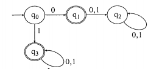

## TS State Machine
Very simple state machine in typescript alongside with example

------

In `src/Examples/BinaryNumbersDFA/AutomatonAcceptingBinaryNumbers.ts` there is an example that creates simple automaton that checks if provided string is a valid binary number:

### How to use?
1. Create states using `State<T>` class, where `T` is a type of data held by the state.
2. Add transitions to states by calling `state.addTransition<K>` function, where `K` is a type of data held by next state
3. (optional) Restet data of initial state by calling `state.resetState` function
4. `let finalState = await state.startWork()` (mind infinite calculations though!)
5. Check what happend by calling `finishState.finishType()`
